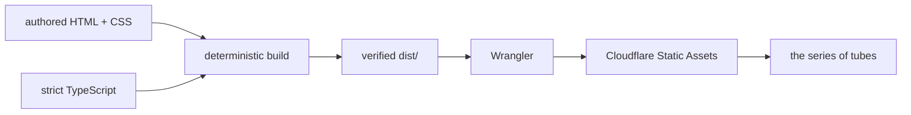

<h1 align="center">✦ villagealchemist ✦</h1>

<p align="center"><strong>A tiny, strongly typed corner of the internet, hand-routed with equal parts systems discipline and glitter.</strong></p>

<p align="center"><a href="https://villagealchemist.com"><strong>Enter the workshop at villagealchemist.com</strong></a></p>

This is the internet home of **MJ, Backend Systems Architect and Open Sourceress**. Right now it is a handmade
anti-Linktree: one small place to find the code, art, credentials, and raven chute while the fuller workshop is brewing.

Linktree was available. So was building exactly one tiny thing correctly.


<p align="center"><em>A real capture of the deployed link hub. No enchanted mockup, no frontend industrial complex.</em></p>

## The tiny internet workshop

**Current reality:** a fast, static link hub with four public routes and several useful exits into the wider series of
tubes.

Visitors can find MJ's GitHub, LinkedIn, resumé, two Instagram workshops, and contact address. The `/dev` and `/art`
doors steer visitors toward the relevant part of the main page, while `/links` provides a dedicated route to the same
hub.

**Incoming:** a fuller internet home with more room for technical work, art, experiments, and whatever else escapes the
cauldron.

The site is built from scratch because the current job is small enough to deserve a small system. Squarespace,
WordPress, React, and their assorted dependency caravans would solve a much larger problem than this page has. Plain
HTML, CSS, and a little precise browser behavior do the work just fine.

## Deliberately small machinery

| Ingredient          | What it does                                                                                |
| ------------------- | ------------------------------------------------------------------------------------------- |
| Static HTML         | Provides the page, route documents, metadata, semantic structure, and real links.           |
| CSS                 | Owns the responsive plum-black, lilac, silver, serif-meets-monospace workshop aesthetic.    |
| Strict TypeScript   | Powers browser behavior, configuration, deterministic builds, and source-policy validation. |
| TypeScript compiler | Emits the browser-compatible files and the temporary build tools.                           |
| Wrangler            | Serves and deploys the verified static assets through Cloudflare Workers Static Assets.     |
| Cloudflare          | Sends the finished little website into the series of tubes.                                 |

There is **no frontend framework and no general-purpose bundler**. The deployed site also carries no third-party runtime
application dependency pile. Development dependencies exist to compile, lint, format, watch, validate, serve, and
deploy the source, then get out of the page's way.

All authored executable code is TypeScript. Browser-compatible JavaScript appears only inside ignored generated output
because browsers remain tragically incapable of executing TypeScript directly. Generated JavaScript is disposable
build material, never canonical source.

## From spellbook to series of tubes



The lifecycle is intentionally boring in all the places where boring prevents incidents:

1. `tsc -p tsconfig.tools.json` compiles the TypeScript build and policy scripts into ignored `.build-tools` output.
2. The prepare phase removes the previous `dist` directory and copies only the explicit static allowlist.
3. `tsc -p tsconfig.browser.json` emits `config.js`, `redirect.js`, and `site.js` into `dist`.
4. The verify phase compares the complete generated file list with the exact expected manifest. Extra or missing files
   fail the build.
5. Wrangler serves or deploys only that verified `dist` boundary.

The build never sweeps the repository for whatever looks publishable. Every deployed file must be named on purpose.

## Map of the workshop

| Path                      | Purpose                                                                                   |
| ------------------------- | ----------------------------------------------------------------------------------------- |
| `index.html`              | Canonical document for `/`; copied to `dist/links/index.html` for `/links`.               |
| `dev/index.html`          | Static redirect document and human-readable fallback for the technical route.             |
| `art/index.html`          | Static redirect document and human-readable fallback for the creative route.              |
| `_redirects`              | Cloudflare redirect rules for `/dev` and `/art`.                                          |
| `styles.css`              | The complete visual system, responsive layout, focus treatment, and reduced-motion rules. |
| `src/client/config.ts`    | Typed public browser configuration, including the contact email address.                  |
| `src/client/site.ts`      | Contact-link hydration plus query-driven scrolling for the technical and creative views.  |
| `src/client/redirect.ts`  | Shared browser fallback for the redirect documents.                                       |
| `scripts/build.ts`        | Allowlisted copy, clean build preparation, and exact output verification.                 |
| `scripts/check-source.ts` | Authored-source and tracked-file policy enforcement.                                      |
| `tsconfig.json`           | Strict, no-emit TypeScript contract for the whole authored codebase.                      |
| `tsconfig.browser.json`   | Browser-source compiler boundary, emitting only into `dist`.                              |
| `tsconfig.tools.json`     | Tooling compiler boundary, emitting only into `.build-tools`.                             |
| `eslint.config.ts`        | Type-aware ESLint configuration for authored TypeScript.                                  |
| `wrangler.jsonc`          | Cloudflare project configuration pointing Static Assets at `dist`.                        |
| `dist/`                   | Ignored, generated, verified deployment output. Safe to destroy and rebuild.              |

There is no authored `links/index.html`; the deterministic build creates that route by copying the canonical root
document. One source, two doors, zero drift.

## Public doors

| Route    | Current behavior                                                                                                                                              |
| -------- | ------------------------------------------------------------------------------------------------------------------------------------------------------------- |
| `/`      | Renders the complete link hub.                                                                                                                                |
| `/links` | Wrangler normalizes the route to `/links/`, which renders the same canonical link hub from the generated `dist/links/index.html`.                             |
| `/dev`   | Redirects to `/?view=dev`; the client centers the GitHub card. The route document also includes a meta refresh and visible fallback link.                     |
| `/art`   | Redirects to `/?view=art`; the client centers the villagealchemist Instagram card. The route document also includes a meta refresh and visible fallback link. |

## Conjure it locally

You need Node.js with npm. The repository does not declare an exact Node version, so this spellbook does not invent
one. `npm ci` installs the locked development toolchain, including Wrangler.

```sh
npm ci
npm run dev
```

Open [http://localhost:42069](http://localhost:42069). The development command builds once, starts the Wrangler server,
and watches the explicit HTML, CSS, redirect, route, and client TypeScript sources for rebuilds.

## Command spellbook

Every npm script in `package.json`, including the smaller incantations used by the main ones:

| Command                 | Actual work performed                                                                                                                    |
| ----------------------- | ---------------------------------------------------------------------------------------------------------------------------------------- |
| `npm run compile:tools` | Compiles `scripts/**/*.ts` into ignored `.build-tools` output.                                                                           |
| `npm run build`         | Compiles the tools, cleans and prepares the allowlisted static files, emits browser JavaScript, then verifies the exact `dist` manifest. |
| `npm run dev`           | Builds first, then runs the file watcher and local Wrangler server together; either failing process stops the pair.                      |
| `npm run dev:watch`     | Watches the explicit authored site files and runs a full build when one changes.                                                         |
| `npm run dev:serve`     | Serves `dist` through `wrangler dev` on port `42069`.                                                                                    |
| `npm run check:source`  | Compiles and runs the authored-source policy checker.                                                                                    |
| `npm run typecheck`     | Runs the strict, no-emit TypeScript project check.                                                                                       |
| `npm run lint`          | Stable alias for `npm run lint:check`.                                                                                                   |
| `npm run lint:check`    | Runs type-aware ESLint over the config, build scripts, and browser source with zero warnings allowed.                                    |
| `npm run lint:apply`    | Runs the same ESLint scope with automatic fixes enabled.                                                                                 |
| `npm run format`        | Stable alias for `npm run format:apply`.                                                                                                 |
| `npm run format:check`  | Verifies Prettier formatting without rewriting files.                                                                                    |
| `npm run format:apply`  | Formats recognized authored files with Prettier.                                                                                         |
| `npm run check`         | Runs source policy, type checking, linting, formatting verification, and the deterministic build in fail-fast order.                     |
| `npm run deploy`        | Builds and verifies `dist`, then invokes `wrangler deploy`. This can change production and requires explicit authorization.              |

## Quality wards

This small site has a surprisingly serious perimeter. That is the fun part.

- **Strict TypeScript:** `strict`, `noImplicitAny`, `noUncheckedIndexedAccess`, exact optional properties, exhaustive control
  flow protections, unused-code checks, and `allowJs: false` keep the types honest.
- **Type-aware linting:** ESLint uses the TypeScript project service and rejects unsafe operations, floating promises,
  unnecessary assertions, unhandled switch cases, explicit `any`, and suppression-shaped escape hatches.
- **Authored-source policy:** the checker rejects authored `.js`, `.mjs`, and `.cjs` files, prohibited TypeScript or lint
  suppressions, and the forbidden Unicode code point U+2014.
- **Canonical-source boundary:** generated directories, dependencies, editor state, lockfiles, and deployment artifacts are
  excluded from authored-source scans where appropriate. Generated browser JavaScript cannot become canonical source.
- **Deterministic allowlist:** every build deletes `dist`, copies a fixed set of static inputs, emits three known browser
  files, and verifies the complete nine-file output manifest.
- **Route verification:** the expected manifest requires the root, links, dev, and art route assets to exist in the
  generated deployment.
- **Formatting gate:** `npm run check` includes Prettier verification alongside source policy, types, lint, and build.
- **Wrangler validation:** `npm run deploy -- --dry-run` builds first and asks Wrangler to validate the deployment without
  publishing it.

The useful distinction: `npm run check` validates the source and deterministic output locally. The Wrangler dry run is a
separate deployment-boundary check and does not publish.

## Deployment without accidental summoning

Local development and production deployment share the same generated boundary, but they are not the same act.

### Local development

```sh
npm run dev
```

This builds `dist`, watches authored sources, and serves the output locally with Wrangler.

### Cloudflare dry run

```sh
npm run deploy -- --dry-run
```

This performs the full build and Wrangler's deployment validation without publishing the site.

### Production

```sh
npm run deploy
```

This performs the same verified build, then deploys through Wrangler. Run it only when a production change has been
explicitly authorized. `wrangler.jsonc` contains the public project configuration; secrets and irrelevant account
internals do not belong in this README or in `dist`.

## Built for human visitors

The page is handmade, but not at the visitor's expense:

- All destinations are real anchors with native keyboard behavior. Link cards and the email link receive a visible
  three-pixel focus outline via `:focus-visible`.
- The document uses `lang`, `main`, `header`, a labelled `nav`, a headed contact section, and `footer` landmarks. Redirect
  documents include titles, canonical URLs, visible text, and ordinary fallback links.
- The layout is fluid down to its declared 320-pixel minimum and expands its spacing at the 650-pixel breakpoint.
- `prefers-reduced-motion: reduce` disables smooth scrolling and link-card transitions.
- External destinations use `noopener noreferrer` when opening a new tab.
- The visual language is dark plum-black, lilac, muted silver, restrained glow, editorial serif, and monospace utility:
  part alchemist's workshop, part early internet, entirely intentional.

These are implementation facts, not a decorative accessibility badge or an unsupported compliance claim.

## Currently in the cauldron

| State       | Work                                                                                                                                                                                                            |
| ----------- | --------------------------------------------------------------------------------------------------------------------------------------------------------------------------------------------------------------- |
| Shipped     | The static, hand-built link-hub phase documented here.                                                                                                                                                          |
| Brewing     | A fuller villagealchemist internet home. No invented milestone dates, just active conjuring.                                                                                                                    |
| Future only | If API work begins, the engineering contract calls for TSOA-generated routes and OpenAPI, a Controllers to Services to Repositories architecture, named request and response models, and Swagger UI at `/docs`. |

There is **currently no API, database, TSOA application, generated OpenAPI specification, or Swagger UI**. Those are
future architecture requirements, not features wearing a fake mustache.

## Find MJ around the tubes

| Portal                      | Destination                                                                                         |
| --------------------------- | --------------------------------------------------------------------------------------------------- |
| GitHub                      | [github.com/villagealchemist](https://github.com/villagealchemist)                                  |
| LinkedIn                    | [MJ on LinkedIn](https://www.linkedin.com/in/mjohnson1307/)                                         |
| Resumé                      | [Public resumé](https://drive.google.com/file/d/1rMrapFZGfu4ipiAqoC3f_PWpUNt_C8tT/view?usp=sharing) |
| Village Alchemist Instagram | [@villagealchemist](https://www.instagram.com/villagealchemist/)                                    |
| Open Sourceress Instagram   | [@open_sourceress](https://www.instagram.com/open_sourceress)                                       |
| Contact                     | [mj@villagealchemist.com](mailto:mj@villagealchemist.com)                                           |

<p align="center"><sub>hand-routed through the series of tubes ▣</sub></p>
