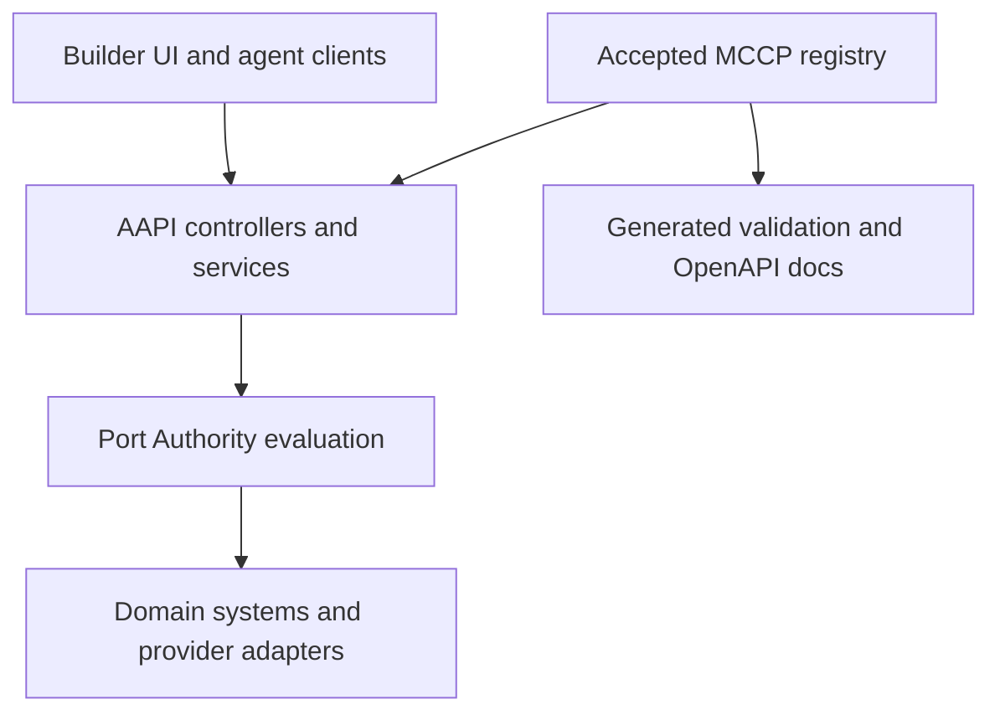

# AAPI foundation

AAPI is the model-agnostic gateway between human or agent clients and real domain systems. It exposes ordinary HTTP
contracts now and is designed so MCP and WebMCP adapters can reuse the same domain commands later.

MCCP defines the semantic capability contract. MCP and WebMCP define communication and invocation surfaces. Port Authority
enforces an accepted MCCP contract at the host and client boundaries.

## Runtime shape



The TypeScript controllers and named request and response models generate both the Express routes and OpenAPI document.
The generated route layer rejects unknown properties and malformed values before a controller executes. Validation failures
return HTTP 422 with field-level errors.

## Current endpoints

| Method | Path                                                  | Purpose                                                            |
| ------ | ----------------------------------------------------- | ------------------------------------------------------------------ |
| GET    | `/api/v0/health`                                      | Report service health and the accepted contract revision.          |
| GET    | `/api/v0/contracts`                                   | Return the accepted MCCP manifest.                                 |
| GET    | `/api/v0/contracts/{capabilityId}`                    | Return one semantic capability contract.                           |
| POST   | `/api/v0/contracts/proposals`                         | Ask a configured provider for an untrusted contract proposal.      |
| POST   | `/api/v0/workspaces/{workspaceId}/decisions/evaluate` | Return `ALLOW`, `ASK`, or `DENY` and record an idempotent receipt. |
| GET    | `/openapi.json`                                       | Return the generated OpenAPI document.                             |
| GET    | `/docs`                                               | Render the generated developer reference with Swagger UI.          |

## Trust boundaries

- The accepted MCCP registry is authoritative. A model response is never authoritative.
- Contract proposals are untrusted drafts until a visible human acceptance flow promotes them.
- Port Authority evaluates policy deterministically and does not delegate authorization to a model.
- Workspace identity is present at every request boundary. A cross-workspace actor or resource is denied.
- Evaluation is not execution. This slice records decisions and receipts but does not call a downstream system.
- The receipt repository is deliberately in memory. Its interface is the persistence seam for a later durable adapter.
- The core has no OpenAI or other model SDK dependency. `DisabledContractProposalProvider` keeps that absence explicit.

## Model provider continuation contract

Provider integrations implement `ContractProposalProvider`. The provider receives only the minimum contract-drafting input
and returns a schema-valid proposal response. Provider credentials stay server-side. Provider selection and model selection
must be configuration, not domain types.

The next provider adapter should preserve these rules:

1. Use provider-neutral environment names for selection, with provider-specific secrets only at the adapter boundary.
2. Validate the provider response before returning it from the service.
3. Never silently fall back from a configured live provider to a mock response.
4. Never allow a provider to accept its own proposal, evaluate policy, execute a capability, or write a receipt.
5. Keep customer fixtures and unrelated context out of proposal requests.

## Run locally

```sh
npm ci
npm run api:start
```

Open `http://127.0.0.1:42100/docs` for the generated reference. Set `AAPI_PORT` to a positive integer to use another port.

## Verify

```sh
npm run check
```

That command runs authored-source policy checks, both TypeScript projects, type-aware linting, formatting verification,
tests, static-site verification, TSOA generation, and the AAPI build.
